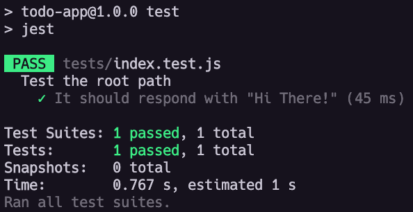

# Review

- [Review](#review)
  - [Initial Setup](#initial-setup)
  - [Reviewing Testing for our API](#reviewing-testing-for-our-api)
    - [Test script](#test-script)
    - [Testing Root Path](#testing-root-path)
    - [GET All Todos](#get-all-todos)
    - [POST (Create) a Todo](#post-create-a-todo)
    - [PUT (Update) a Todo](#put-update-a-todo)
      - [You Do](#you-do)
  - [Setting up Component Testing with Jest for our React Frontend](#setting-up-component-testing-with-jest-for-our-react-frontend)
    - [Test 1: Verifying Header Text](#test-1-verifying-header-text)
    - [Test 2: Adding an Item to the List](#test-2-adding-an-item-to-the-list)
      - [Test 3: Deleting All Items from the List](#test-3-deleting-all-items-from-the-list)
  - [Setting up E2E Testing for our React Frontend](#setting-up-e2e-testing-for-our-react-frontend)
    - [What is Selenium?](#what-is-selenium)
    - [Setup](#setup)
    - [Selenium Dependency Setup](#selenium-dependency-setup)
    - [Selenium Testing](#selenium-testing)
      - [Test 1: Verifying the Header Text](#test-1-verifying-the-header-text)
      - [Test 2: Adding an Item to the List](#test-2-adding-an-item-to-the-list-1)
      - [Test 3: This test checks that clicking the "Finished the list!" button (YOU DO)](#test-3-this-test-checks-that-clicking-the-finished-the-list-button-you-do)
  - [Dockerize the Todo App](#dockerize-the-todo-app)
    - [Create the Container network](#create-the-container-network)
    - [Create a Dockerfile for the Postgres Database](#create-a-dockerfile-for-the-postgres-database)
    - [Dockerfile for Node Express Backend](#dockerfile-for-node-express-backend)
    - [Dockerfile for the React frontend](#dockerfile-for-the-react-frontend)
  - [Debugging: To stop and remove all containers](#debugging-to-stop-and-remove-all-containers)

We're going to start with a working application, add functional tests for the frontend and backend, and one end-to-end test for the entire application. We'll then containerize it using Docker.

## Initial Setup

1. Open your terminal.
2. To access the `mef` directory, please navigate to it from your home directory using the command `cd ~/mef`.
3. Fork the repository named [final-review](https://git.generalassemb.ly/ModernEngineering/final-review) on the
   GitHub website.
4. Click the "Fork" button in the upper right corner of the repository page. This will create a copy of the repository
   under your own GitHub account.
5. After forking, you'll have your own copy of the repository under your GitHub account.
    - Copy the URL of your forked repository, which will look
      like: `https://github.com/YourUsername/final-review.git`.
6. Now clone the repository using the SSH URL.
7. To change your current working directory to `express-todo-api` within the cloned `final-review` repository, you
   can use the following commands: `cd final-review/express-todo-api/`.
8. To reset the existing database using the `psql` command, you can use the following
   command: `psql -U postgres -d todo_app_db < db/todo.sql`.
9. To install dependencies to our project, use the `npm install` command.
10. To open the express-todo-api project in VSCode, use the command `code .`.

NOTE: If you get a message that a port is in use, you can [kill it](https://tecadmin.net/kill-process-on-specific-port/) with this
command: `sudo kill -9 $(sudo lsof -t -i:3001)`.

## Reviewing Testing for our API

In this review walkthrough, we'll be going over Jest and how to set it up to your node/express backend.

Install your testing dependencies for Jest and Supertest: `npm install jest supertest`

### Test script

In the `express-todo-api/tests` directory, there is a file called  `index.test.js`. The file begins by declaring dependencies: `app`, `server`, and `pool` from our `index.js`, and `supertest`.

```javascript
// tests/index.test.js

// DEPENDENCIES
const request = require("supertest");
const {app, server, pool} = require("../index");
```

In order for the last three imports to be successful, we have to export them from the `index.js` file.

```javascript
// index.js
module.exports = {app, server, pool};
```

### Testing Root Path

Back in the `index.test.js`, let's test the root path to verify that everything is configured correctly:

```javascript
describe("Test the root path", () => {
    test('It should respond with "Hi There!"', async () => {
        const response = await request(app).get("/");
        expect(response.text).toBe("Hi There");
        expect(response.statusCode).toBe(200);
    });
});
```

In the terminal, run `npm run test`.



In order to halt the server and exit back to the terminal prompt after the test runs, we add an `afterAll` method at the bottom of the `index.test.js` file that'll close the server and the pool to resolve any asynchronous operations.

```javascript
// Closing the connection allows Jest to exit successfully.
afterAll((done) => {
    server.close()
    pool.end()
    done()
});
```

### GET All Todos

The next test we'll write is the `GET /api/todos` route. If the response status is 200, that means the call was successful. We'll then check to see if the length of the response payload is greater than zero.

```javascript
// GET all todos
describe("GET /api/todos", () => {
    it("should retrieve a list of todos", async () => {
        const response = await request(app)
            .get("/api/todos")
            .expect(200);

        expect(response.body.length).toBeGreaterThan(0);
    });
});
```

### POST (Create) a Todo

The next is the `POST /api/todos` method which will create a new todo. The goal is to pass an object with new todo data, convert it to JSON, and pass that that in the request body. The test will expect a successful status (201). At the end of this function, we save the new todo object ID to a variable called `todoID` that we will use for future tests.

```javascript
// POST (create) new todo
let todoID;
describe("POST /api/todos", () => {
    it("should create a new todo", async () => {
        const todoData = {title: "Test Todo", done: false};
        const response = await request(app)
            .post("/api/todos")
            .send(todoData)
            .expect(201);

        todoId = response.body.id;
    });
});
```

### PUT (Update) a Todo

We want a test for our update functionality. The following code creates a new object `updatedTodoData` consisting of the updated todo data. That object is converted to JSON, then sent in the body of a PUT request. The `todoID` is the same one that we declared in the POST test. We append the `todoID` to the end of the path to indicate which todo should be updated. If all goes well, we expect a 200 status cod.e.The test also expects a response body of `Todo modified with ID: ${todoId}`.

```javascript
describe("PUT /api/todos/:todoId", () => {
    it("should update a todo by ID", async () => {
        const updatedTodoData = {title: "Updated Todo", done: true};
        const response = await request(app)
            .put(`/api/todos/${todoId}`)
            .send(updatedTodoData)
            .expect(200); // 

        expect(response.body).toBe(`Todo modified with ID: ${todoId}`);
    });
});
```

#### You Do

We currently don't have a test for each endpoint. The goal for the next 30 minutes is to write tests for

- the `GET /api/todos/:todoId` endpoint
- the `DELETE /api/todos/:todoId` endpoint

<details>
<summary>No peeking at the solutions until you're done!</summary>
<br>

```javascript
describe("GET /api/todos/:todoId", () => {
    it("should retrieve a specific todo by ID", async () => {
        const response = await request(app)
            .get(`/api/todos/${todoId}`)
            .expect(200);

        expect(response.body[0].id).toBe(todoId);
    });
});
```

```javascript
describe("DELETE /api/todos/:todoId", () => {
    it("should delete an existing todo", async () => {
        await request(app)
            .delete(`/api/todos/${todoId}`)
            .expect(204);

        // Verify that the todo has been deleted
        const response = await request(app)
            .get(`/api/todos/${todoId}`)
            .expect(200);

        expect(response.body.length).toBe(0);
    });
});
```
</details>

## Setting up Component Testing with Jest for our React Frontend

1. Create a `tests` folder in the `src` directory: `mkdir tests`
2. Within the new directory, make a subdirectory called `components`: `mkdir tests/components`.
3. Then create a new file called `App.test.js`: `touch tests/components/App.test.js` which will be our test file.

Component testing, particularly in the context of front-end development and frameworks like React, plays a crucial role in ensuring the reliability, functionality, and user experience of individual components within an application. 

The primary objectives and benefits of component testing include:

- Ensuring Correct Behavior
- Detecting Bugs Early
- Improving Code Quality
- Facilitating Refactoring and Enhancements
- Streamlining Development and Collaboration
- Enhancing User Experience

Let's break down what each test does

### Test 1: Verifying Header Text

- This test checks that the MyList component renders a header with the specified text "Things I should stop procrastinating:".
- It renders the MyList component with a prop theList that contains an array of to-do items (toDos).
- getByRole fetches the first element with the semantic role of 'heading'.
- expect and toHaveTextContent verify that the fetched element contains the correct text content.

```js
test('Header contains the text "Things I should stop procrastinating:"', () => {
    const myList = render(<MyList theList={toDos} />);
    const heading = myList.getByRole('heading');
    expect(heading).toHaveTextContent('Things I should stop procrastinating:');
});
```

### Test 2: Adding an Item to the List

- This test simulates adding a new to-do item ("Renew Passport") to the list.
- It locates the input field by its placeholder text and the button by its text content.
- fireEvent.change simulates typing into the input field. fireEvent.click simulates clicking the button.
- waitFor is used to handle any asynchronous updates. Then it checks that the new item was added to the list by verifying the last item's text content.

```js
test('Entering text into text input and clicking "Add it!" button adds the item to the list', () => {
    const myList = render(<MyList theList={toDos} />);
    const input = myList.getByPlaceholderText('Type an item here');
    const button = myList.getByText("Add it!");

    fireEvent.change(input, { target: { value: "Renew Passport" } });
    fireEvent.click(button);

    waitFor(() => {
        const list = myList.getByRole("list");
        const items = within(list).queryAllByRole("listitem");
        const lastItem = items[items.length - 1];

        expect(lastItem).toHaveTextContent("Renew Passport");
    });
});
```

#### Test 3: Deleting All Items from the List

- This test simulates clearing the to-do list by clicking a button labeled "Finished the list!".
- After clicking the button, it checks that there are no items left in the list by looking for elements with the role "listitem" and expecting their count to be 0.

```js
test('Clicking on "Finished the list!" will delete all elements in the list', () => {
    const myList = render(<MyList theList={toDos} />);
    const button = myList.getByText("Finished the list!");

    fireEvent.click(button);

    const list = myList.queryAllByRole("listitem");
    expect(list.length).toBe(0);
});
```

To run the test use `npm run test` command.

## Setting up E2E Testing for our React Frontend

### What is Selenium?

Selenium is a powerful tool commonly used for automating web browsers, particularly for testing web applications. React is a popular JavaScript library for building user interfaces, including web applications. Combining Selenium with a React application allows for automated testing of the user interface, ensuring functionality, performance, and user experience.

### Setup

To begin, please open a new terminal window and navigate to the `/final-review/react-to-do-frontend-starter` folder: 

1. In the terminal, run `cd ~/mef/final-review/react-to-do-frontend-starter`
2. From this directory, open VS Code: `code .`
3. Open the terminal window within VSCode and execute the following commands:
    - Run `npm i` to install the necessary Node.js dependencies.
    - Now we want our testing framework. Install the selenium-webdriver package in your project: `npm install selenium-webdriver`
    - Make sure your backend is running if your app isn't working, then `npm run start` in your frontend directory to confirm the app is working. NOTE: If you get a message that a port is in use, you can kill it with this command: `sudo kill -9 $(sudo lsof -t -i:3000)`.
    - After you've verified that everything works, run `CTRL+C` in the terminal to stop running the React app.
4.  Create a `tests` folder in the `src` directory: `mkdir tests`
5.  Within the new directory, make a subdirectory called `e2e`: `mkdir tests/e2e`, then create a new file called `selenium-todos.test.js`: `touch tests/e2e/selenium-todos.test.js` which will be our test file.
6. Run the selenium test. Only run our `selenium-todos.test.js` file enter the command in another terminal or you can run the command `npm test -- --testPathPattern=selenium-todos.test.js`.

### Selenium Dependency Setup

In the `selenium-todos.test.js` file, we'll need to import `selenium-webdriver`.
```
const selenium = require('selenium-webdriver');
```

### Selenium Testing

#### Test 1: Verifying the Header Text

Purpose: This test checks if the page contains an `<h1>` tag with the specific text "Things I should stop procrastinating:".

Steps:

- Find the `<h1>` Element: Uses Selenium's findElement method with a CSS selector to locate the first `<h1>` tag on the page.
- Retrieve the Element's Text: Gets the text content of the found `<h1>` element.
- Assertion: Compares the retrieved text to the expected text. The test passes if they match, indicating the header contains the correct text.

```js
test(' should verify h1 text', async function () {
    const h1Element = await driver.findElement(selenium.By.css('h1'));
    const actualText = await h1Element.getText();
    const expectedText = 'Things I should stop procrastinating:';

    expect(actualText).toBe(expectedText);
})
```

#### Test 2: Adding an Item to the List

Purpose: Tests if a user can add a new item ("Eat more ice cream") to a list through the UI and verifies that the item appears as expected.

Steps:

- Find the Input Element: Locates the text input field where a user can type a new item, identified by its placeholder text.
- Enter Text with Delay: Simulates typing the text "Eat more ice cream" into the input field, character by character, with a short delay between each to mimic human typing.
- Submit the New Item: Presses the RETURN key to submit the form or trigger the action that adds the new item to the list.
- Verify the Addition: Finds all list items (`<li>`) and checks the text of the last item to ensure it matches the text that was entered. The test passes if the last item's text is "Eat more ice cream", indicating that the item was successfully added to the list.

```js
test('Add Item to List', async () => {
    const inputElement = await driver.findElement(selenium.By.css('[placeholder="Type an item here"]'));

    for (const char of 'Eat more ice cream') {
        await inputElement.sendKeys(char);
        await new Promise(resolve => setTimeout(resolve, 50)); // Add a delay of 50 milliseconds
    }

    await inputElement.sendKeys(selenium.Key.RETURN);
    
    const listItems = await driver.findElements(selenium.By.css('li'));
    const lastItemText = await listItems[listItems.length - 1].getText();

    expect(lastItemText).toBe('Eat more ice cream');
});
```

#### Test 3: This test checks that clicking the "Finished the list!" button (YOU DO)

- Successfully deletes all elements from the list, ensuring the list is empty afterwards.

## Dockerize the Todo App

Now it's time to containerize the application. Refer to the [docker-commands.md](docker-commands.md) file for a table of Docker commands.

Make sure you stop all running instances of node and stop the PostgreSQL server using the command `sudo service postgresql stop`.

### Create the Container network

We'll need to create a container network for your containers to talk to each other. Containers in the same container network can resolve each others' host names by their container name.

`sudo docker network create todo-app`

If you get an error that the network already exists, proceed to the next step.

### Create a Dockerfile for the Postgres Database

1. Inside the `express-todo-api/db` folder there is a starter `Dockerfile`. Modify it as follows to build an image for the PostgreSQL database.

    ```dockerfile
    FROM postgres
    # This is the image we'll use as the base

    ENV POSTGRES_PASSWORD docker
    # This is the password we'll define for the Docker Postgres instance

    ENV POSTGRES_DB todo_app_db
    # This is what we'll name the database inside the container

    COPY todo.sql /docker-entrypoint-initdb.d/
    # Copy the todo.sql file to the listed path in the container
    # This will create the todos table and add some todos
    ```

2. Go into the `db` directory in your terminal and build the image: `sudo docker build . -t db`.

3. To run the image in a container: `sudo docker run -d --name db-container -p 5432:5432 --network todo-app db`

4. To confirm that we created the table and added some todos:

    - `sudo docker exec -it db-container psql todo_app_db -U postgres`
        - This will get us into the container and enter the `psql` shell
    - `SELECT * FROM todos;`
        - Get all the todos

    

### Dockerfile for Node Express Backend

1. The `index.js` in the backend currently points to the `localhost` hostname for the database and uses `postgres` as the password. Modify `index.js` to point to the `db-container` hostname and use `docker` as the password.
2. There's a `Dockerfile` in the `express-todo-api` folder. Modify it as follows:

    ```dockerfile
    FROM node:alpine
    # This is the image we'll use as the base

    WORKDIR /usr/src/app
    # Create app directory

    COPY . .
    # Copy the app to the directory

    RUN npm install
    # Install dependencies

    EXPOSE 3001
    # The port we want the container to open (i.e. run on)

    CMD [ "npm", "run", "start" ]
    # The command to start the server inside the container
    ```

3. In your terminal, go into the `express-todo-api` folder and build the image: `sudo docker build . -t backend`.

4. To run the image in a container: `sudo docker run -d --name backend-container -p 3001:3001 --network todo-app backend`

5. Run `sudo docker ps` to check out the list of running containers.

6. Go to `localhost:3001` in the browser. We should see the same "Hi There" message as if running the app locally.

    

7. Go to `http://localhost:3001/api/todos/` in your browser. You should see a list of todos.

### Dockerfile for the React frontend

1. In the `react-to-do-frontend-starter` there's a starter `Dockerfile`. Modify it as follows:

    ```dockerfile
    FROM node:alpine
    # This is the image we'll use as the base

    WORKDIR /usr/src/app
    # Create app directory

    COPY . .
    # Copy the app to the directory

    RUN npm install
    # Install dependencies

    EXPOSE 3000
    # The port we want the container to open (i.e. run on)

    CMD [ "npm", "run", "start" ]
    # The command to start the server inside the container
    ```

2. In your terminal, navigate to the `react-to-do-frontend-starter` folder and build the image: `sudo docker build . -t frontend`.

3. To run the image in a container: `sudo docker run -d --name frontend-container -p 3000:3000 --network todo-app frontend`

4. Go to `localhost:3000` in the browser.

## Debugging: To stop and remove all containers

If you get a message saying that a container name is already taken, you may need to stop and remove a container or two.

- To stop all running containers: `sudo docker stop $(sudo docker ps -a -q)`
- To show all stopped containers: `sudo docker ps -a`
- To remove all stopped containers: `sudo docker container prune`
- To remove one container: `sudo docker rm -f [container-name-or-id]`
- To remove all images: `sudo docker rmi $(sudo docker images -a -q)`

Also, if you get a message that post 5432 is in use, make sure to stop the local PostgreSQL service in your VM: `sudo service postgresql stop`